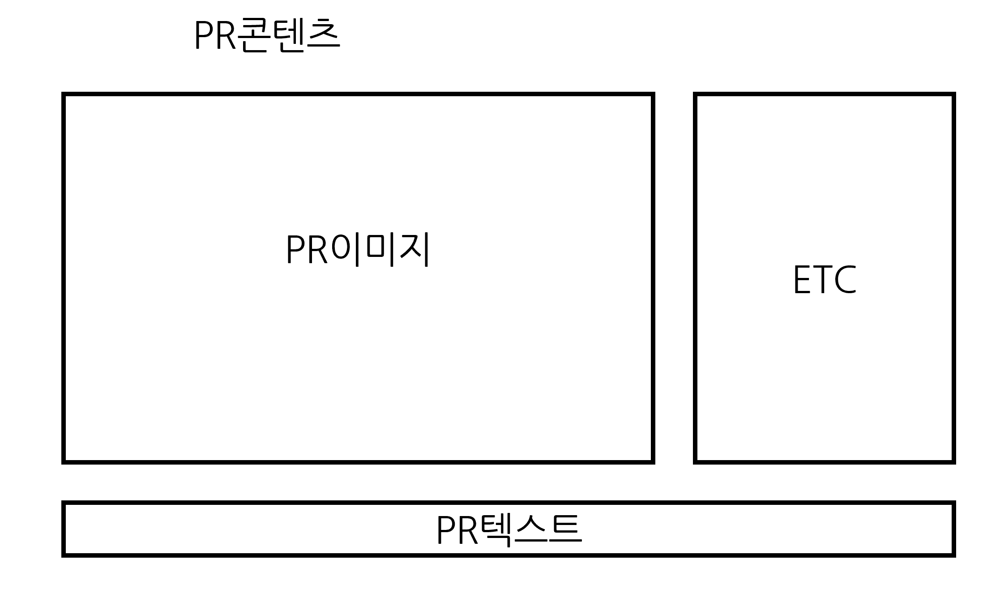

https://drive.google.com/file/d/1XhwO-Fq7k-mumZkcEWgtqEDMUjXmV98K/view?usp=sharing

위 링크를 통해서 내가 만들었던 pdf를 확인할 수 있음.

그냥 다운받아

그외 필요한 자료
Column, Row 관련
https://m.blog.naver.com/cowbori/222081713773

캡스톤 시작
asdfasdf
2022년 8월 29일 1주차. 와이어 프레임 및 회의 진행

2022년 9월 5일  2주차. 와이어 프레임 및 회의, 제작 시작

2022년 9월 12일 3주차, 각자 역할을 분배해 제작

자기가 한 내용들 날짜별로 써주길 바람.

이도훈
2022/09/16 스폰서, 인플 화면 구성만 대충 잡음
2022/09/23 인플 첫 화면 Gridview
2022/09/30 인플 Gridview 눌러서 넘어가는 페이지 틀만 대충 잡음
2022/10/14 광고글 데이터 firebase에 삽입
2022/10/21 document데이터 불러오기 원정연 똑똑노
2022/10/28 adList배열 삽입
2022/11/13 grid 출력
2022/12/04 광고에 인플이 지원하는 버튼 만들었습니다

원정연

정민수-채팅기능
2022/09/21 채팅목록 탭시 상세채팅방으로 넘어가기, 길게눌렀을떄 다이얼로그 띄우기
2022/09/23 상세채팅방 시작. 텍스트 입력시 db에 넘어감. 아직 채팅내용을 db에서 불러오는건 미완성.
2022/09/28 채팅입력시 db에 저장.
2022/09/29 상세채팅방 완료. db내용 비동기적으로 불러오고 채팅시작시나 채팅입력시 맨아래로 스크롤기능 (채팅방기능 완료시 이에따라 추가수정필요)
2022/10/08 db구조 단순화작업

손승호
2022/09/16 대략적인 인터페이스
2022/09/18 스폰서용 이미지 삽입 구동확인
2022/09/23 사진 사이즈 조절 및 텍스트 나오게함
2022/10/07 파이어베이스 이미지 연동 완료

권택형 - 로그인 및 메인화면 관리.
2022/09/13  로그인 화면 UI만 대충 구축
2022/09/18  파이어베이스 이메일 로그인 완성, 로그인 되어있을시 바로 메인화면 띄우기 완성
            DB구축 원정연이 푸쉬 안해서 다시 처음부터 만듦ㅋㅋ 
2022/09/24  이메일 인증 및 비밀번호 재설정 완료.
2022/09/25  도훈이형 프2 완성시킴
2022/10/07  로그인쪽 관련 화면 UI 만지는 중
2022/10/10  로그인 화면 전부 완성

import 'package:firebase_core/firebase_core.dart';
import 'firebase_options.dart';

// ...

await Firebase.initializeApp(
options: DefaultFirebaseOptions.currentPlatform,
);

## Page1 -  인플루언서 홍보용 PR 방향
### PR 콘텐츠
- 여기서 PR콘텐츠란, FZU에서 사용자의 입력을 받아 생성한 인플루언서의 홍보용 프리셋임.
- PR콘텐츠는 사용자가 입력한 PR이미지, PR텍스트, ETC... 등으로 구성됨.
- PR이미지는 프로필사진과 별개의 개념임.
- PR텍스트는 홍보용 문구와 비슷한 개념임. 다만 회원가입 시 작성한 자기소개와는 별개의 개념임.(추후 그 자기소개를 그대로 갖다 쓸 수 있게 하는 체크박스도 구현할 예정)
- 사실상 사용자에게 PR콘텐츠는 하나의 이미지처럼 노출됨.
- FZU가 설정할 PR콘텐츠 프리셋은 다음과 같음.
  </img>

- 사용자는 이런 프리셋을 사용하지 않고 <u>자신이 직접 커스텀한 이미지만 노출</u>하도록 할 수 있음.
- FZU는 커스텀 기능은 제공하지 않음.
### 스폰서 노출
- 스폰서는 Page1에서 인플루언서들의 정보를 확인할 수 있음.
- 이 정보에는 PR콘텐츠, 인플루언서들의 간단한 스펙, 카테고리가 해당됨.
- 